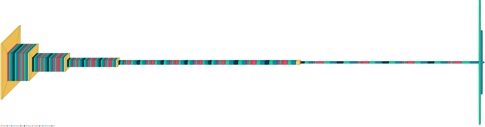

# 🩸 Blood Cell Type Image Classification using Transfer Learning (MobileNetV2)

<a href="#"></a>
<a href="#"></a>
<a href="#"></a>
<a href="#"></a>
<a href="#"></a>

<br>

Blood Cell Type Prediction  
Apr 2023

---

# 📌 Project Description

This project aims to classify blood cell types using deep learning and transfer learning techniques.  
The **MobileNetV2 architecture** is used as a **pre-trained model for feature extraction**, and a **custom classification model** is built on top of it.

---

# 🎯 Project Goal

The goal of this project is to develop an **automated method for detecting and classifying blood cell subtypes** using machine learning techniques.

The project utilizes a dataset containing **12,500 augmented images of blood cells**, each labeled with the corresponding cell type.

The dataset consists of four different cell types:

- Eosinophil  
- Lymphocyte  
- Monocyte  
- Neutrophil  

In this project we build a **deep learning based image classification model using a pretrained MobileNetV2 model and applying the concept of transfer learning.**

---

# 🧠 Transfer Learning

## What is Transfer Learning?

Transfer learning is a technique that uses knowledge gained from a **pre-trained model on one task** to boost performance on a **different but related task**.

It takes advantage of the learned features and representations from the pre-trained model, which can be applied to a new task.  
This approach helps overcome **data limitations**, **speeds up training**, and **improves performance** on new tasks.

---

## Benefits of Transfer Learning

1️⃣ **Improved Performance**

By leveraging pre-trained models trained on large datasets, transfer learning helps achieve higher performance on new tasks with limited data.

2️⃣ **Faster Training**

Transfer learning reduces training time and computational resources because the base model already understands many general image features.

3️⃣ **Better Generalization**

Models learn abstract features that work well across different tasks.

4️⃣ **Data Efficiency**

Models can perform well even with smaller datasets.

---

# 📊 Project Overview

The project consists of the following key steps:

### 1️⃣ Data Acquisition

Download the dataset from Kaggle:

https://www.kaggle.com/datasets/paultimothymooney/blood-cells

---

### 2️⃣ Data Preprocessing

The image data is loaded and preprocessed using the `ImageDataGenerator` class from TensorFlow.

The dataset is divided into:

- Training dataset  
- Validation dataset  

---

### 3️⃣ Build Pretrained Model

The **MobileNetV2 model** is loaded with **pre-trained weights** and frozen to retain its learned features.

Additional **custom classification layers** are added for blood cell classification.

---

### 4️⃣ Training the Model

The model is trained using the **training dataset** and validated using the **validation dataset**.

Training includes:

- Multiple epochs
- Early stopping to prevent overfitting

---

### 5️⃣ Evaluating Results

The trained model is evaluated on the **test dataset**.

Evaluation includes:

- Loss
- Accuracy
- Classification Report
- Confusion Matrix

---

# 📂 Project Structure

```
Blood-Cell-Classification
│
├── README.md
├── model.ipynb
├── model_using_xception.ipynb
├── requirements.txt
│
├── model_architecture.png
├── model_using_mobilenet_v2.png
├── model_using_xception.png
```

---

# 🧠 Model Architecture

The following diagram represents the architecture of the deep learning model used for blood cell classification.

<p align="center">

</p>

---

# 📊 Training Results

The graphs below show the training and validation loss and accuracy during model training.

<p align="center">

</p>

---

## 📉 Confusion Matrix

The confusion matrix below shows how the model performed in classifying each blood cell type.

<p align="center">

" width="700">
</p>

# 🚀 Getting Started

To reproduce this project, follow these steps.

---

## 1️⃣ Dataset Preparation

Prepare a dataset of blood cell images divided into:

- Training directory
- Testing directory

Update the following variables in the code:

```
train_dir
test_dir
```

---

## 2️⃣ Environment Setup

Set up a Python environment and install dependencies:

```bash
pip install -r requirements.txt
```

---

## 3️⃣ Run the Model

Execute the notebook:

```
model.ipynb
```

Run all cells sequentially to:

- Load dataset
- Train model
- Evaluate results

---

## 4️⃣ Analyze Results

After training, review:

- Training vs Validation Accuracy
- Training vs Validation Loss
- Confusion Matrix
- Classification Report

---

# 📈 Results

Based on the validation dataset:

- The model achieves **94.5% accuracy on validation images**

Possible reasons for lower performance on the test dataset:

1. The test data may contain mislabeled samples  
2. The test dataset may have been generated differently from the training dataset

The confusion matrix suggests that the **neutrophil class may contain mixed samples from other classes.**

---

# 📌 Conclusion

This project demonstrates the application of **transfer learning using the MobileNetV2 architecture for blood cell type classification.**

Although the model achieves **high validation accuracy**, further investigation is required to understand the difference between validation and test performance.

The project can be extended and optimized to improve **accuracy and generalization capability**.
